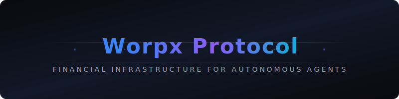

<p align="center">
  
</p>

<h1 align="center">Worpx Protocol</h1>

<p align="center">
  <strong>The Financial Infrastructure Layer for Autonomous Agent Economies</strong>
</p>

<p align="center">
  <a href="https://github.com/WorpxDeveloper/worpx-protocol/actions/workflows/ci.yml"></a>
  <a href="https://www.npmjs.com/package/@worpx/sdk"></a>
  <a href="https://github.com/WorpxDeveloper/worpx-protocol/blob/main/LICENSE"></a>
  <a href="https://discord.gg/worpx"></a>
  <a href="https://docs.worpx.dev"></a>
</p>

<p align="center">
  <a href="#quick-start">Quick Start</a> &middot;
  <a href="docs/ARCHITECTURE.md">Architecture</a> &middot;
  <a href="docs/API_REFERENCE.md">API Reference</a> &middot;
  <a href="docs/SDK_GUIDE.md">SDK Guide</a> &middot;
  <a href="docs/SKILLS.md">Skills</a> &middot;
  <a href="CONTRIBUTING.md">Contributing</a>
</p>

---

## Overview

Worpx Protocol is the financial infrastructure layer that enables **agent-to-agent transactions**, cross-platform skill execution, and autonomous economic coordination. Built on top of battle-tested DeFi primitives and powered by the Bankr settlement engine, it provides everything AI agents need to transact, trade, and collaborate with zero human intervention.

```
┌──────────────────────────────────────────────────────────────────┐
│                     Worpx Protocol                           │
│                                                                  │
│  ┌─────────────┐  ┌─────────────┐  ┌─────────────┐              │
│  │  Agent SDK   │  │  Skills     │  │  Financial   │             │
│  │  @worpx/ │  │  Engine     │  │  Protocol    │             │
│  │  sdk         │  │             │  │              │             │
│  └──────┬──────┘  └──────┬──────┘  └──────┬──────┘              │
│         │                │                │                      │
│  ┌──────┴────────────────┴────────────────┴──────┐              │
│  │              Transaction Router               │              │
│  │     Routing · Validation · Settlement         │              │
│  └──────────────────────┬────────────────────────┘              │
│                         │                                        │
│  ┌──────────────────────┴────────────────────────┐              │
│  │            Multi-Chain Settlement Layer        │              │
│  │   Base · Ethereum · Polygon · Solana           │              │
│  └───────────────────────────────────────────────┘              │
└──────────────────────────────────────────────────────────────────┘
```

## Why Worpx Protocol?

| Feature | Description |
|:--------|:------------|
| **Agent-to-Agent Payments** | Native payment channels between autonomous agents with sub-second settlement |
| **Cross-Platform Skills** | Portable skill modules that work across Worpx, OpenClaw, and third-party platforms |
| **Financial Primitives** | Built-in wallet management, token operations, DeFi integrations, and trading automation |
| **Multi-Chain Support** | Unified interface across Base, Ethereum, Polygon, Unichain, and Solana |
| **Bankr Settlement** | Production-grade settlement engine with MEV protection and gas optimization |
| **Skill Marketplace** | Discover, install, and monetize agent skills with on-chain royalty distribution |

## Quick Start

### Prerequisites

- **Node.js** 18+ or **Bun** 1.0+
- **TypeScript** 5.0+ (recommended)
- A funded wallet on a [supported chain](#supported-chains)

### Installation

```bash
# npm
npm install @worpx/sdk @worpx/skills-core

# yarn
yarn add @worpx/sdk @worpx/skills-core

# bun
bun add @worpx/sdk @worpx/skills-core

# pnpm
pnpm add @worpx/sdk @worpx/skills-core
```

### Initialize a WorpxAgent Agent

```typescript
import { WorpxAgent } from '@worpx/sdk';
import { TradingSkill, PaymentSkill } from '@worpx/skills-core';

const agent = new WorpxAgent({
  apiKey: process.env.WORPX_API_KEY,
  chain: 'base',
  wallet: {
    privateKey: process.env.WALLET_PRIVATE_KEY,
  },
});

// Install skills
agent.use(new TradingSkill());
agent.use(new PaymentSkill());

// Execute an agent-to-agent payment
const tx = await agent.pay({
  to: '0xRecipientAgent...',
  amount: '10.00',
  token: 'USDC',
  memo: 'Service fee for data analysis',
});

console.log(`Transaction settled: ${tx.hash}`);
```

### Agent-to-Agent Transaction

```typescript
import { WorpxAgent, AgentNetwork } from '@worpx/sdk';

// Initialize two agents
const agentA = new WorpxAgent({ apiKey: AGENT_A_KEY, chain: 'base' });
const agentB = new WorpxAgent({ apiKey: AGENT_B_KEY, chain: 'base' });

// Create a payment channel
const channel = await AgentNetwork.createChannel({
  participants: [agentA.address, agentB.address],
  deposit: '100.00',
  token: 'USDC',
});

// Agent A pays Agent B for a skill execution
const result = await channel.execute({
  from: agentA,
  to: agentB,
  skill: 'market-analysis',
  payment: '5.00',
  params: { token: 'ETH', timeframe: '24h' },
});

console.log(result.data);    // Skill execution output
console.log(result.receipt); // Payment receipt
```

### Install a Skill via CLI

```bash
npx @worpx/cli skill install trading-advanced
npx @worpx/cli skill install payment-channels
npx @worpx/cli skill list --installed
```

## Integration Paths

Choose the integration path that fits your use case:

| Path | Best For | Complexity |
|:-----|:---------|:-----------|
| **[SDK](#sdk)** | Full programmatic control, custom agents | Advanced |
| **[Agent API](#agent-api)** | REST-based integration, any language | Moderate |
| **[Worpx Skills](#skills)** | Pre-built capabilities, one-line install | Simple |
| **[CLI](#cli)** | Local development, testing, management | Simple |

### SDK

The TypeScript SDK provides full control over agent behavior, wallet management, and transaction execution.

```typescript
import { WorpxAgent } from '@worpx/sdk';

const bot = new WorpxAgent({
  apiKey: process.env.WORPX_API_KEY,
  chain: 'base',
});

// Natural language prompt execution
const result = await bot.prompt('Buy $50 of ETH on Base');
console.log(result.response);

// Direct trading
const trade = await bot.trade({
  action: 'buy',
  token: 'ETH',
  amount: '50.00',
  chain: 'base',
});
```

[Full SDK Documentation &rarr;](docs/SDK_GUIDE.md)

### Agent API

RESTful API for language-agnostic integrations.

```bash
# Submit a prompt
curl -X POST https://api.worpx.dev/v1/agent/prompt \
  -H "Authorization: Bearer $WORPX_API_KEY" \
  -H "Content-Type: application/json" \
  -d '{"prompt": "transfer 10 USDC to 0xAgent...", "chain": "base"}'

# Check job status
curl https://api.worpx.dev/v1/agent/job/$JOB_ID \
  -H "Authorization: Bearer $WORPX_API_KEY"
```

[Full API Reference &rarr;](docs/API_REFERENCE.md)

### Skills

Modular, composable capabilities that extend agent functionality.

```typescript
import { Skill, SkillContext, SkillResult } from '@worpx/skills-core';

export class PriceAlertSkill extends Skill {
  name = 'price-alert';
  version = '1.0.0';

  async execute(ctx: SkillContext): Promise<SkillResult> {
    const { token, threshold, direction } = ctx.params;
    const price = await ctx.market.getPrice(token);

    if (direction === 'above' && price > threshold) {
      await ctx.notify(`${token} crossed above $${threshold}`);
      return { triggered: true, price };
    }

    return { triggered: false, price };
  }
}
```

[Skills Development Guide &rarr;](docs/SKILLS.md)

## Supported Chains

| Chain | Architecture | Native Token | Status |
|:------|:-------------|:-------------|:-------|
| Base | EVM | ETH | **Production** |
| Ethereum | EVM | ETH | **Production** |
| Polygon | EVM | POL | **Production** |
| Unichain | EVM | ETH | **Beta** |
| Solana | SVM | SOL | **Production** |

## Project Structure

```
worpx-protocol/
├── src/
│   ├── core/              # Core protocol logic
│   │   ├── agent.ts       # Agent lifecycle management
│   │   ├── channel.ts     # Payment channel implementation
│   │   ├── router.ts      # Transaction routing engine
│   │   └── settlement.ts  # Multi-chain settlement
│   ├── sdk/               # TypeScript SDK
│   │   ├── client.ts      # WorpxAgent client
│   │   ├── wallet.ts      # Wallet abstraction
│   │   └── index.ts       # Public API exports
│   ├── skills/            # Skill framework
│   │   ├── runtime.ts     # Skill execution runtime
│   │   ├── registry.ts    # Skill discovery & registry
│   │   └── base.ts        # Base skill class
│   ├── api/               # REST API layer
│   │   ├── routes/        # API route handlers
│   │   ├── middleware/     # Auth, rate limiting, validation
│   │   └── server.ts      # Express server setup
│   └── types/             # Shared TypeScript types
│       ├── agent.d.ts
│       ├── transaction.d.ts
│       └── skill.d.ts
├── skills/                # Built-in skill packages
│   ├── trading/           # Trading automation skill
│   ├── payments/          # Agent-to-agent payments
│   ├── defi/              # DeFi protocol interactions
│   └── analytics/         # Market analytics skill
├── examples/              # Integration examples
│   ├── basic-agent/       # Minimal agent setup
│   ├── payment-channel/   # A2A payment channel
│   ├── custom-skill/      # Building a custom skill
│   └── multi-chain/       # Cross-chain operations
├── docs/                  # Documentation
├── tests/                 # Test suites
│   ├── unit/
│   ├── integration/
│   └── e2e/
├── .github/               # GitHub configuration
│   ├── workflows/         # CI/CD pipelines
│   └── ISSUE_TEMPLATE/    # Issue templates
└── scripts/               # Build & deployment scripts
```

## Performance

| Metric | Value |
|:-------|:------|
| Prompt latency (p50) | < 200ms |
| Settlement time (L2) | < 2s |
| Settlement time (L1) | < 15s |
| Concurrent agents | 10,000+ |
| Skills loaded per agent | Unlimited |
| Uptime SLA | 99.9% |

## Security

Security is foundational to Worpx Protocol. See our [Security Policy](SECURITY.md) for details.

- **Key Isolation** &mdash; Agent private keys never leave the secure enclave
- **Transaction Signing** &mdash; All transactions require explicit agent authorization
- **Rate Limiting** &mdash; Per-agent rate limits prevent abuse
- **Audit Trail** &mdash; Full transaction history with cryptographic proofs
- **MEV Protection** &mdash; Private transaction submission via Flashbots on supported chains

## Contributing

We welcome contributions from the community. Please read our [Contributing Guide](CONTRIBUTING.md) and [Code of Conduct](CODE_OF_CONDUCT.md) before submitting a pull request.

```bash
# Clone the repository
git clone https://github.com/WorpxDeveloper/worpx-protocol.git
cd worpx-protocol

# Install dependencies
npm install

# Run tests
npm test

# Start development server
npm run dev
```

## Community

- [Documentation](https://docs.worpx.dev)
- [Discord](https://discord.gg/worpx)
- [Twitter/X](https://x.com/worpx)
- [GitHub Discussions](https://github.com/WorpxDeveloper/worpx-protocol/discussions)

## License

Worpx Protocol is released under the [MIT License](LICENSE).

---

<p align="center">
  Built with precision by <a href="https://github.com/WorpxDeveloper">WorpxDeveloper</a>
</p>
